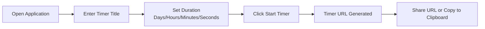
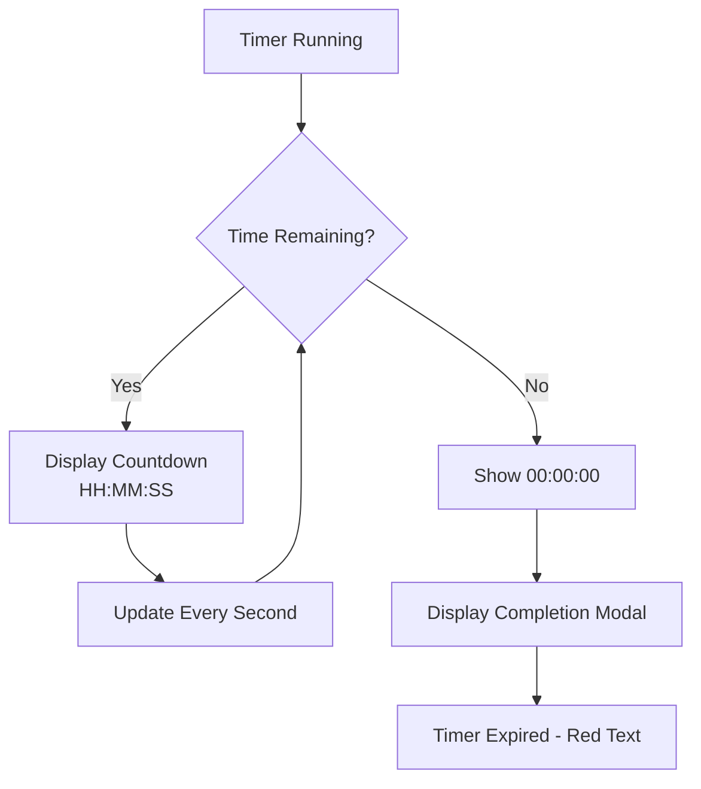
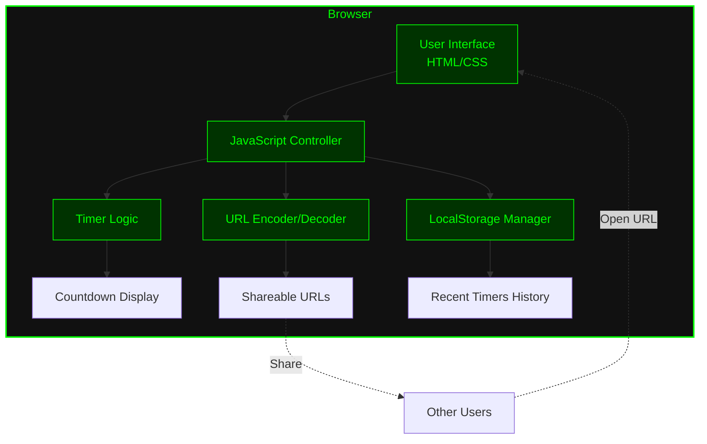

# xsukax Shared Timers

A lightweight, privacy-focused web application for creating and sharing persistent countdown timers with unique URLs. Built as a single HTML file with zero dependencies and complete client-side functionality.


**Demo:** [https://xsukax.github.io/xsukax-Shared-Timers](https://xsukax.github.io/xsukax-Shared-Timers)

## Project Overview

xsukax Shared Timers is a minimalist timer application designed for users who need to create, share, and track countdown timers across teams, events, or personal projects. The application operates entirely in the browser with no server-side processing, offering instant timer creation with shareable URLs that persist across sessions.

Key characteristics:
- **Single-file architecture**: The entire application is contained in one HTML file (~15KB)
- **No backend required**: All functionality executes client-side using vanilla JavaScript
- **Zero dependencies**: No external libraries, frameworks, or API calls
- **Instant deployment**: Works on any web server or can be opened directly in a browser
- **Cross-platform compatibility**: Functions identically across all modern browsers and devices

## Security and Privacy Benefits

This application prioritizes user privacy and security through its architectural design:

### Complete Client-Side Operation
All timer calculations, data encoding, and storage operations occur entirely within the user's browser. No data is transmitted to external servers, eliminating risks associated with data breaches, unauthorized access, or third-party tracking.

### No Server-Side Data Collection
The application requires no backend infrastructure, meaning:
- **Zero server logs**: No IP addresses, user agents, or access patterns are recorded
- **No analytics tracking**: The application includes no telemetry, cookies, or tracking scripts
- **No user accounts**: No registration, authentication, or personally identifiable information is collected

### URL-Based Timer Encoding
Timer data is encoded directly into shareable URLs using Base64 encoding. This approach ensures:
- **Ephemeral sharing**: Timer information exists only in the URL itself
- **User control**: Users decide when and with whom to share timer links
- **No centralized database**: Timer data is never stored on any server

### Local Storage Privacy
Recent timers are stored exclusively in the browser's localStorage:
- **Device-specific**: Timer history remains on the user's device and is never synchronized or uploaded
- **User-controlled**: Users can clear localStorage at any time to remove all timer history
- **No cross-device tracking**: Timer history does not follow users across different browsers or devices

### Transparent Source Code
As a single HTML file with embedded JavaScript and CSS, the entire codebase is:
- **Fully auditable**: Users and security researchers can inspect every line of code
- **Open source**: Licensed under GNU GPL v3.0 for complete transparency
- **No obfuscation**: Plain, readable code with no minification or hidden functionality

## Features and Advantages

### Core Functionality
- **Flexible duration settings**: Configure timers from 1 second to 365 days with granular control (days, hours, minutes, seconds)
- **Shareable URLs**: Each timer generates a unique, portable URL containing all timer data
- **Real-time countdown**: Live updates every second with accurate time remaining display
- **Automatic expiration detection**: Visual and modal notifications when timers reach zero
- **Recent timers management**: Browse, reopen, and delete previously created timers

### User Experience
- **Terminal-inspired interface**: Clean, distraction-free design with hacker-aesthetic green-on-black theme
- **Responsive layout**: Optimized for desktop, tablet, and mobile devices
- **Fullscreen mode**: Dedicated fullscreen view for prominent timer display
- **Timezone awareness**: All timestamps automatically display in the user's local timezone
- **Keyboard shortcuts**: Quick actions via Ctrl+C (copy URL), F11 (fullscreen), and Esc (close modal)

### Technical Advantages
- **No installation required**: Runs directly in any modern web browser
- **Offline capable**: Once loaded, timers continue to function without internet connectivity
- **Stateless operation**: No sessions, cookies, or persistent server connections
- **Minimal resource usage**: Lightweight footprint with negligible CPU and memory consumption
- **Self-contained deployment**: Single file can be hosted anywhere or run locally

## Installation Instructions

### Option 1: GitHub Pages Deployment (Recommended)
1. Fork this repository to your GitHub account
2. Navigate to repository **Settings** → **Pages**
3. Under **Source**, select the branch (typically `main` or `master`)
4. Click **Save**
5. GitHub will provide your deployment URL (e.g., `https://yourusername.github.io/xsukax-Shared-Timers`)

### Option 2: Local File System
1. Clone or download this repository:
   ```bash
   git clone https://github.com/xsukax/xsukax-Shared-Timers.git
   ```
2. Navigate to the project directory
3. Open `index.html` directly in your web browser (double-click or right-click → Open With)

### Option 3: Web Server Deployment
Deploy to any static hosting service:

**Apache/Nginx:**
```bash
# Copy index.html to web server document root
cp index.html /var/www/html/timers/
```

**Python HTTP Server (Development):**
```bash
# Serve current directory on port 8000
python3 -m http.server 8000
# Access at http://localhost:8000
```

**Node.js HTTP Server:**
```bash
npx http-server -p 8000
```

### Option 4: Cloud Hosting
Upload `index.html` to platforms such as:
- **Netlify**: Drag and drop the file into the Netlify dashboard
- **Vercel**: Deploy via CLI or GitHub integration
- **AWS S3**: Upload to S3 bucket with static website hosting enabled
- **Cloudflare Pages**: Connect repository or upload directly

### PHP Configuration
This application does **not** require PHP, as it operates entirely with client-side JavaScript. No `php.ini` configuration is necessary. The application consists solely of HTML, CSS, and JavaScript, requiring only a web server capable of serving static files.

## Usage Guide

### Creating a Timer



**Step-by-step process:**

1. **Access the application** via your deployment URL or local file
2. **Configure timer parameters:**
   - **Timer Title**: Enter a descriptive name (e.g., "Project Deadline", "Meeting Start")
   - **Duration**: Set days (0-365), hours (0-23), minutes (0-59), and seconds (0-59)
3. **Start the timer** by clicking the "🚀 Start Timer" button
4. **Share the timer** using the generated URL displayed on screen

### Sharing Timers

Once created, timers can be shared via:
- **Copy URL button**: Click "📋 Copy URL" to copy the link to clipboard
- **Manual sharing**: Copy the URL from the browser address bar
- **Direct access**: Recipients can open the URL in any browser to view the live countdown

**Timer URL structure:**
```
https://your-domain.com/index.html?t=BASE64_ENCODED_TIMER_DATA
```

The URL parameter `t` contains Base64-encoded JSON with:
- Timer title
- Start timestamp (Unix epoch)
- Duration in seconds
- Creation timestamp

### Monitoring Active Timers



**Timer display features:**
- **Live countdown**: Updates every second showing hours:minutes:seconds remaining
- **Visual feedback**: Timer turns red and pulses when expired
- **Completion notification**: Modal popup alerts when timer reaches zero
- **Fullscreen option**: Click "⛶ Fullscreen" for full-screen countdown display

### Managing Recent Timers

The application maintains a local history of your 15 most recent timers:

1. **View history**: Recent timers appear on the home screen (when not viewing an active timer)
2. **Reopen timers**: Click "Open" to return to any previous timer
3. **Check status**: Each timer shows:
   - Creation date and time (in your local timezone)
   - Original duration
   - Current status (Running with time remaining, or Completed)
4. **Delete timers**: Click "Delete" to remove timers from your local history

**Note:** Recent timer history is stored in browser localStorage and is device-specific. Clearing browser data will remove this history.

### Keyboard Shortcuts

| Shortcut | Action |
|----------|--------|
| `Ctrl+C` | Copy current timer URL to clipboard |
| `F11` | Toggle fullscreen mode for timer display |
| `Esc` | Close modal notifications |

### Architecture Overview



## Browser Compatibility

Tested and verified on:
- Chrome/Edge 90+
- Firefox 88+
- Safari 14+
- Opera 76+
- Mobile browsers (iOS Safari, Chrome Mobile, Firefox Mobile)

## Contributing

Contributions are welcome! To contribute:

1. Fork the repository
2. Create a feature branch (`git checkout -b feature/your-feature`)
3. Make your changes to `index.html`
4. Test thoroughly across multiple browsers
5. Commit your changes (`git commit -m 'Add your feature'`)
6. Push to the branch (`git push origin feature/your-feature`)
7. Open a Pull Request with a detailed description

## License

This project is licensed under the GNU General Public License v3.0.

## Support

For issues, questions, or feature requests:
- **GitHub Issues**: [https://github.com/xsukax/xsukax-Shared-Timers/issues](https://github.com/xsukax/xsukax-Shared-Timers/issues)
- **Repository**: [https://github.com/xsukax/xsukax-Shared-Timers](https://github.com/xsukax/xsukax-Shared-Timers)

---

**Built with privacy and simplicity in mind** • No tracking • No ads • No data collection
