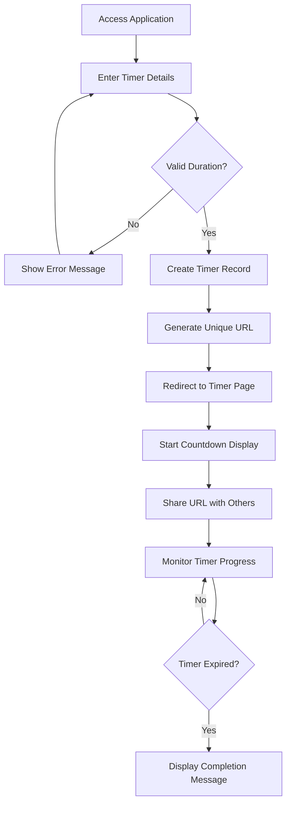
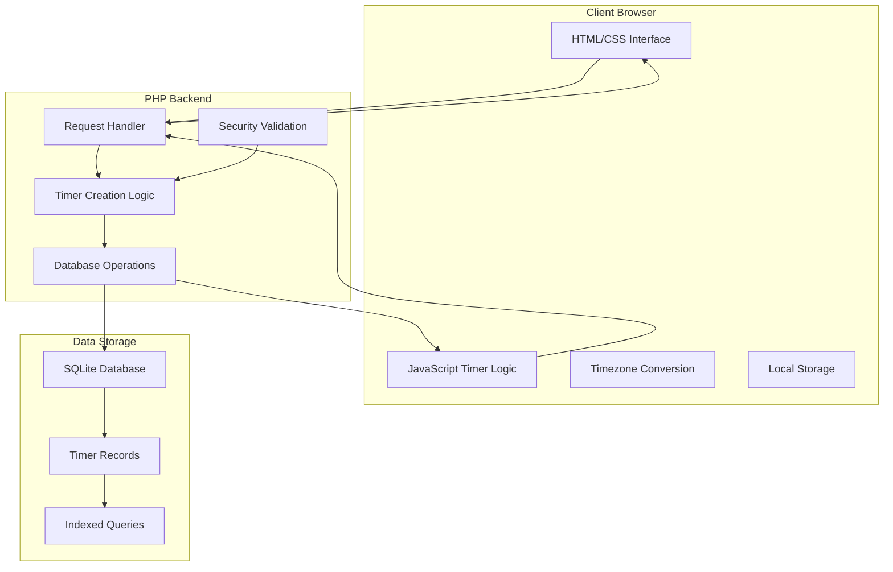

# xsukax Shared Timers

A lightweight, privacy-focused shared timer application with local timezone support and persistent URLs. Create countdowns that can be shared with anyone while maintaining user privacy through IP-based isolation.


## Project Overview

xsukax Shared Timers is a single-file PHP application designed for creating persistent, shareable countdown timers. Built with privacy and simplicity in mind, the application generates unique URLs for each timer, allowing users to share countdowns without requiring user accounts or authentication.

The application features a distinctive terminal-style interface with green text on a black background, providing a clean, distraction-free countdown experience. All timestamps are handled client-side, ensuring that timers display correctly in each user's local timezone regardless of server location.

**Key Capabilities:**
- Create persistent timers with custom titles and durations (up to 365 days)
- Generate unique shareable URLs for each timer
- Real-time countdown display with automatic refresh
- Fullscreen mode for focused timing sessions
- Recent timer history for quick access
- Responsive design optimized for both desktop and mobile devices

## Security and Privacy Benefits

### Privacy-First Architecture
- **IP-Based Isolation**: Users only see timers they created, ensuring privacy without requiring user accounts
- **No Personal Data Collection**: No usernames, emails, or personal information required or stored
- **Client-Side Timezone Handling**: Timezone information never leaves the user's browser, preventing location tracking
- **Minimal Data Storage**: Only essential timer data (duration, start time, title, ip) is persisted

### Security Measures
- **SQL Injection Prevention**: All database queries use PDO prepared statements
- **XSS Protection**: All user inputs are sanitized using `htmlspecialchars()` before display
- **Input Validation**: Comprehensive server-side and client-side form validation
- **Error Handling**: Secure error messages that don't expose system information
- **File Permission Management**: Database files are created with appropriate permissions
- **Resource Limits**: Maximum timer duration limits prevent abuse

### Data Integrity
- **Database Constraints**: Foreign key relationships and data type enforcement
- **Index Optimization**: Performance indexes for efficient querying
- **Atomic Operations**: Database transactions ensure data consistency
- **Backup-Friendly**: SQLite database can be easily backed up and restored

## Features and Advantages

### Core Features
- ✅ **Single-File Deployment**: Entire application contained in one PHP file
- ✅ **Zero Configuration**: Works out-of-the-box with minimal setup
- ✅ **Persistent Timers**: Timers continue running even if browsers are closed
- ✅ **Shareable URLs**: Each timer gets a unique URL for easy sharing
- ✅ **Local Timezone Support**: Automatically displays times in user's timezone
- ✅ **Real-Time Updates**: Countdown refreshes every second without page reloads
- ✅ **Mobile Responsive**: Optimized interface for all screen sizes

### Advanced Capabilities
- 🎯 **Fullscreen Mode**: Distraction-free countdown display
- 📋 **One-Click URL Copying**: Easy sharing with clipboard integration
- 📱 **Progressive Web App Ready**: Can be installed on mobile devices
- ⌨️ **Keyboard Shortcuts**: Quick actions via keyboard controls
- 🎨 **Terminal Aesthetic**: Distinctive hacker-style visual design
- 📊 **Timer History**: View and access previously created timers

### Competitive Advantages
- **Privacy-Focused**: No tracking, accounts, or personal data collection
- **Lightweight**: Minimal resource requirements and fast loading
- **Self-Hosted**: Complete control over data and functionality
- **Open Source**: Fully auditable and customizable code
- **Cross-Platform**: Works on any system with PHP support
- **Offline-Ready**: Functions without internet after initial load

## Installation Instructions

### Prerequisites
- PHP 7.4 or higher
- PHP Extensions: `pdo`, `pdo_sqlite`
- Web server (Apache, Nginx, or PHP built-in server)
- Write permissions for the application directory

### Quick Installation

#### Option 1: Single File Setup
```bash
# Download the application
wget https://raw.githubusercontent.com/xsukax/xsukax-Shared-Timers/refs/heads/main/index.php

# Or clone the repository
git clone https://github.com/xsukax/xsukax-Shared-Timers.git
cd xsukax-Shared-Timers

# Set proper permissions
chmod 644 index.php
chmod 755 .
```

#### Option 2: Database Pre-initialization
```bash
# Clone the repository
git clone https://github.com/xsukax/xsukax-Shared-Timers.git
cd xsukax-timers

# Make the initialization script executable
chmod +x init_db.sh

# Initialize the database
./init_db.sh

# Set web server permissions
sudo chown -R www-data:www-data .
sudo chmod 664 timers.db
```

### Web Server Configuration

#### Apache Configuration
```apache
<VirtualHost *:80>
    ServerName timers.yourdomain.com
    DocumentRoot /path/to/xsukax-timers
    
    <Directory /path/to/xsukax-timers>
        AllowOverride All
        Require all granted
    </Directory>
</VirtualHost>
```

#### Nginx Configuration
```nginx
server {
    listen 80;
    server_name timers.yourdomain.com;
    root /path/to/xsukax-timers;
    index index.php;
    
    location / {
        try_files $uri $uri/ /index.php?$query_string;
    }
    
    location ~ \.php$ {
        fastcgi_pass unix:/var/run/php/php8.1-fpm.sock;
        fastcgi_index index.php;
        fastcgi_param SCRIPT_FILENAME $document_root$fastcgi_script_name;
        include fastcgi_params;
    }
}
```

#### Development Server
```bash
# For development and testing
cd /path/to/xsukax-timers
php -S localhost:8080
```

### Post-Installation Verification
1. Access the application via web browser
2. Create a test timer (e.g., 5 minutes)
3. Verify the countdown displays correctly
4. Test URL sharing functionality
5. Check that the database file `timers.db` is created

## Usage Guide

### Creating Your First Timer



### Step-by-Step Usage

#### 1. Creating a Timer
1. **Access the Application**: Navigate to your installed application URL
2. **Enter Timer Details**:
   - **Title**: Provide a descriptive name (optional, defaults to "Timer")
   - **Duration**: Set days, hours, minutes, and seconds
3. **Start Timer**: Click "🚀 Start Timer" to create and begin countdown
4. **Get Shareable URL**: Copy the generated URL from the timer page

#### 2. Sharing Timers
- **Copy URL**: Use the "📋 Copy URL" button for instant clipboard copying
- **Share Link**: Send the URL to anyone who needs to view the timer
- **Access Anywhere**: Recipients can view the timer from any device/browser

#### 3. Managing Timers
- **View History**: Recent timers appear in "Your Recent Timers" section
- **Quick Access**: Click on any previous timer to view its current status
- **Status Monitoring**: See real-time status (Running/Completed) for all your timers

### Advanced Features

#### Fullscreen Mode
- Click "⛶ Fullscreen" for distraction-free countdown display
- Press `F11` or `Escape` to exit fullscreen mode
- Ideal for presentations or focused timing sessions

#### Keyboard Shortcuts
- `Ctrl + C`: Copy current timer URL
- `F11`: Toggle fullscreen mode
- `Escape`: Close modal dialogs or exit fullscreen

#### Timer Duration Examples
```
Short Breaks:    0d 0h 5m 0s   (5-minute break)
Pomodoro:        0d 0h 25m 0s  (25-minute focus session)
Meeting Timer:   0d 1h 0m 0s   (1-hour meeting)
Event Countdown: 7d 0h 0m 0s   (week-long countdown)
```

### Application Architecture



### Database Schema

The application uses a simple but effective SQLite schema:

```sql
CREATE TABLE timers (
    id INTEGER PRIMARY KEY AUTOINCREMENT,
    start_timestamp INTEGER NOT NULL,       -- Unix timestamp (UTC)
    duration_seconds INTEGER NOT NULL,      -- Timer duration in seconds
    creator_ip VARCHAR(45) NOT NULL,        -- IPv4/IPv6 address
    created_at INTEGER NOT NULL,            -- Creation timestamp (UTC)
    title VARCHAR(255) DEFAULT 'Timer'      -- User-defined title
);

-- Performance indexes
CREATE INDEX idx_creator_ip ON timers(creator_ip);
CREATE INDEX idx_start_timestamp ON timers(start_timestamp);
CREATE INDEX idx_created_at ON timers(created_at);
```

### Troubleshooting

#### Common Issues and Solutions

**Database Permission Errors**
```bash
# Fix file permissions
sudo chown www-data:www-data timers.db
sudo chmod 664 timers.db
```

**PHP Extension Missing**
```bash
# Ubuntu/Debian
sudo apt-get install php-sqlite3 php-pdo-sqlite

# CentOS/RHEL
sudo yum install php-pdo php-sqlite3

# Restart web server after installation
sudo systemctl restart apache2  # or nginx
```

**Timer Not Updating**
- Check browser JavaScript is enabled
- Verify system clock synchronization
- Clear browser cache and reload

**URL Sharing Issues**
- Ensure web server is accessible from target networks
- Check firewall settings for port 80/443
- Verify DNS resolution for domain name

## Performance Optimization

### Database Maintenance
```bash
# Optimize database (run periodically)
sqlite3 timers.db "VACUUM;"
sqlite3 timers.db "ANALYZE;"
```

### Cleanup Old Timers
```sql
-- Remove completed timers older than 30 days
DELETE FROM timers 
WHERE (start_timestamp + duration_seconds) < (strftime('%s', 'now') - 2592000);
```

## Contributing

We welcome contributions to improve xsukax Shared Timers! Please feel free to:

1. **Report Bugs**: Use GitHub Issues for bug reports
2. **Suggest Features**: Propose new functionality via Issues
3. **Submit Pull Requests**: Follow standard GitHub workflow
4. **Improve Documentation**: Help enhance user guides and code comments

### Development Setup
```bash
git clone https://github.com/xsukax/xsukax-Shared-Timers.git
cd xsukax-Shared-Timers
php -S localhost:8080  # Start development server
```

## License

This project is licensed under the **GNU General Public License v3.0** (GPL-3.0).

You are free to:
- ✅ Use this software for any purpose
- ✅ Study and modify the source code
- ✅ Distribute copies of the software
- ✅ Distribute modified versions

Under the conditions that:
- 📋 You include the original copyright notice
- 📋 You include the full license text
- 📋 You make your modifications open source under GPL-3.0
- 📋 You document any changes made to the original code

For the complete license terms, see the [LICENSE](LICENSE) file in this repository or visit [https://www.gnu.org/licenses/gpl-3.0.html](https://www.gnu.org/licenses/gpl-3.0.html).

---

**Made with ❤️ for the open-source community** | **Privacy-first • Security-focused • User-friendly**
